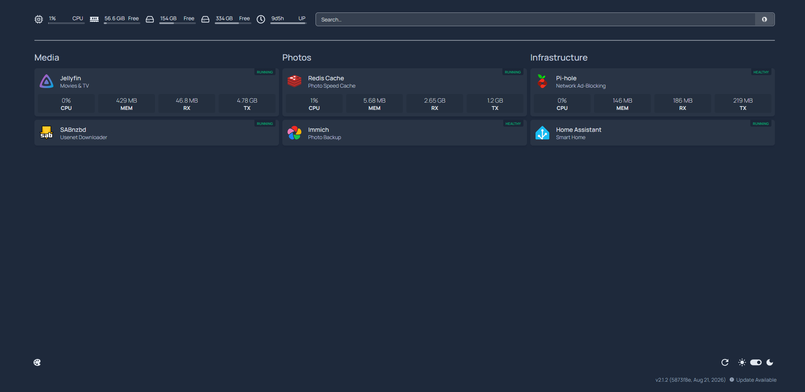

# Dashboard

Internal reverse proxy + service dashboard for the rest of the homelab.

**Stack:**
- **Nginx Proxy Manager** — reverse proxy, handles ports 80/443/81. Sits on
  both `utility-dashboard-net` and `media-automation-net` so it can proxy
  Jellyfin and the other arr-stack services alongside everything else
- **docker-socket-proxy** — sits between Homepage and the real Docker
  socket. Homepage never touches `/var/run/docker.sock` directly; it only
  talks to this proxy, which is locked down to read-only calls (no
  start/stop/restart/exec) per its own env flags
- **Homepage** — read-only dashboard, shows container status and links.
  No start/stop/restart/exec — Portainer was skipped intentionally since
  CLI already covers management fine. Originally monitored every container
  on the server, but that used more CPU than expected just polling stats,
  so trimmed it down to the handful of services I actually check day to day

**Design note:** Homepage used to mount the host's root filesystem read-only
(`/:/nvme:ro`) to power a storage-usage widget. Read-only limits what it
can do with that access, but it's still a broad read surface for one
container to have and honestly I didn't find myself using the widget so much 
and ended up removing it.

**Why:** wanted one glance to see what's running instead of checking each
service, and wanted that glance to have zero write/exec access to Docker
if it were ever compromised — the socket-proxy is the piece that actually
enforces that.

